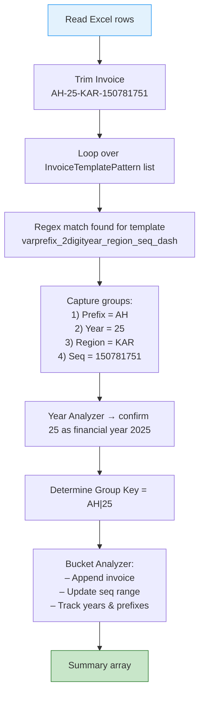
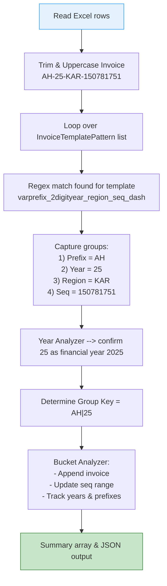

# Invoice Number Analyzer

---

## Table of Contents

1. [High-level Data-Flow](#1-high-level-data-flow)
2. [Repository Components](#2-components)
3. [Template Engine](#3-template-engine)
4. [Deep-Dive: Prefix • Year • Sequence extraction](#4-deep-dive-prefix-•-year-•-sequence-extraction)
5. [Worked Example – AH-25-KAR-150781751](#5-worked-example--ah-25-kar-150781751)
6. [Running the CLI](#6-running-the-cli)
7. [Extending the list of templates](#7-extending-the-list-of-templates)
8. [Dependencies / Requirements](#8-dependencies--requirements)

---

## 1. High-level Data-Flow




Use the CLI front-end (`index.php`) to load rows from Excel.  Each value then passes through the pipeline shown above.

* **ExcelHandler** – opens the sheet and yields the raw invoice strings.
* **EnhancedDocNoAnalyzer** – the orchestrator that glues all other analysers together.
* **YearAnalyzer** – figures out which 2-digit/4-digit numbers are actual years.
* **PatternAnalyzer** – parses the regex templates and replaces `[SEQ]` / `[YEAR]` placeholders.
* **BucketAnalyzer** – stores grouped information (min/max sequence, prefixes, sample invoices …) in `BucketInfo` value objects.

At the end the CLI prints a JSON summary and (optionally) writes a multi-sheet Excel file with the same information.

---

## 2. Components

| Path | What it does |
|------|--------------|

| `index.php` | Thin CLI wrapper. Reads command-line flags, calls the analyser and prints the output. |

| `excel/ExcelHandler.php` | Uses PhpSpreadsheet to **read** the source file and **write** the optional results workbook. |

| `analyzer/EnhancedDocNoAnalyzer.php` | Central class that: ① loads all regex templates, ② dispatches every invoice through them, ③ feeds results to the `BucketAnalyzer`. |

| `analyzer/YearAnalyzer.php` | Heuristics to decide whether a numeric token is a year & which financial year pattern it belongs to. |

| `analyzer/PatternAnalyzer.php` | Generates *smart* patterns where numbers are replaced by `[SEQ]` and `[YEAR]`; extracts every numeric token together with its offset in the string. |

| `analyzer/BucketAnalyzer.php` | Keeps an associative array of `BucketInfo` objects – one *bucket* per template/prefix/year combination. |

| `models/*` | Plain-old PHP objects that carry strongly-typed information (input config, template definitions, bucket metrics, number metadata…). |

---

## 3. Template Engine

All allowed formats live in `models/InvoiceTemplateManager::createDefault()` and are represented by `InvoiceTemplatePattern` objects.  Each template contains:

* **name** – unique id (`varprefix_2digityear_region_seq_dash`).
* **regex** – PCRE pattern **with capture-groups**.
* **yearGroups / sequenceGroups / prefixGroups** – arrays of *group indices* identifying where each token lives inside the regex.

Those indices let the analyser automatically pick the right part of the match without having to hard-code post-processing for every template.

---

## 4. Deep-Dive: Prefix • Year • Sequence extraction

1. **Template Match** – The invoice is matched against each template's compiled regex until the first hit is found.

2. **`determineGroupKey()`** – Using `prefixGroups` + `yearGroups` the method calculates a *group key* that determines the bucket.
   * If the prefix itself is numeric the year becomes the primary key so that *2025 and 25* are bucketed together.

3. **Number splitting** – For concatenated strings (e.g. `AF25KAR150781751`) `smartSplitConcatenatedNumbers()` inserts dashes so that years/sequences become separate tokens.

4. **Year confirmation** – `YearAnalyzer::analyzeYears()` collects frequency of all candidate years in the current group; only values that reach 40 % of the rows and at least 10 occurrences are *confirmed*.

5. **Sequence extraction** – `extractSequentialNumbers()` walks over every numeric token **skipping confirmed years**.  Leading-zeros are preserved so the range 0001-0100 is not reported as 1-100.

### 4.1  Examples of the rules

| Raw invoice | Template | Prefix | Year | Sequence |
|-------------|----------|--------|------|----------|
| `ABC-2024-048` | `prefix_year_seq_dash` | ABC | 2024 | 048 |
| `BILL-25-7887` | `bill-2digit-year-seq` | BILL | 25 | 7887 |
| `ABC24001` | `prefix_seq_year_concatenated` | ABC | 24 | 0001 |
| `AF-25-KAR-150781751` | `varprefix_2digityear_region_seq_dash` | AF | 25 | 150781751 |

---

## 5. Worked Example – `AH-25-KAR-150781751`

1. **Upper-case & trim** → `AH-25-KAR-150781751` (already clean).
2. Regex match → template **`varprefix_2digityear_region_seq_dash`**.
3. Captured groups:
   * `AH` (variable prefix)
   * `25` (2-digit financial year → 2025)
   * `KAR` (region)
   * `150781751` (sequence)
4. `determineGroupKey` builds `AH|25`.
5. Bucket key becomes `varprefix_2digityear_region_seq_dash|AH|25`.
6. Sequence range is updated (min/max) and `BucketAnalyzer` appends the invoice to its sample list.

### 5.1  Flowchart for the Example



(The same diagram is inserted at the top as well.)


---

## 6. Running the CLI

```bash
php index.php \
    --file=invoice_numbers.xlsx \
    --sheet=Sheet1 \
    --column=1 \
    --rows=0            # 0 = all rows
    --header=true       # set to false if your sheet has no header row
```

Flags are optional; sensible defaults are provided (the excel file should be present in the directory)
Default values can be changed in: index.php (line 24)

At the end you will see:

* A:  **Array of lists, each containing the min_value, max_value and count** 

``` bash
=== Raw Array Output ===
Array
(
    [0] => Array
        (
            [template] => varprefix_2digityear_region_seq_dash
            [sample_invoice] => AF-25-KAR-150780751
            [min_value] => 150780751
            [max_value] => 150781250
            [count] => 500
        )

    [1] => Array
        (
            [template] => varprefix_2digityear_region_seq_dash
            [sample_invoice] => AG-25-KAR-150781251
            [min_value] => 150781251
            [max_value] => 150781750
            [count] => 500
        )

    [2] => Array
        (
            [template] => varprefix_2digityear_region_seq_dash
            [sample_invoice] => AH-25-KAR-150781751
            [min_value] => 150781751
            [max_value] => 150782250
            [count] => 500
        )

    [3] => Array
        (
            [template] => varprefix_2digityear_region_seq_dash
            [sample_invoice] => AI-25-KAR-150782251
            [min_value] => 150782251
            [max_value] => 150782750
            [count] => 500
        )

)
```
For unmatched invoices, the following format will be shown

``` bash
=== Raw Array Output ===
Array
(
    [0] => Array
        (
            [template] => unmatched
            [sample_invoice] => AA-2024/001
            [min_value] => AA-2024/001
            [max_value] => DD-2024/500
            [count] => 2000
        )

)
```

---

## 7. Extending the list of templates

Add new instances to the array inside `InvoiceTemplateManager::createDefault()`.  All you need is a correct regex and the indices of the prefix/year/sequence capture-groups.

---

## 8. Dependencies / Requirements

* PHP 8.1+
* [phpoffice/phpspreadsheet](https://github.com/PHPOffice/PhpSpreadsheet) – already installed via Composer.

Install dependencies:

```bash
composer install
```


 